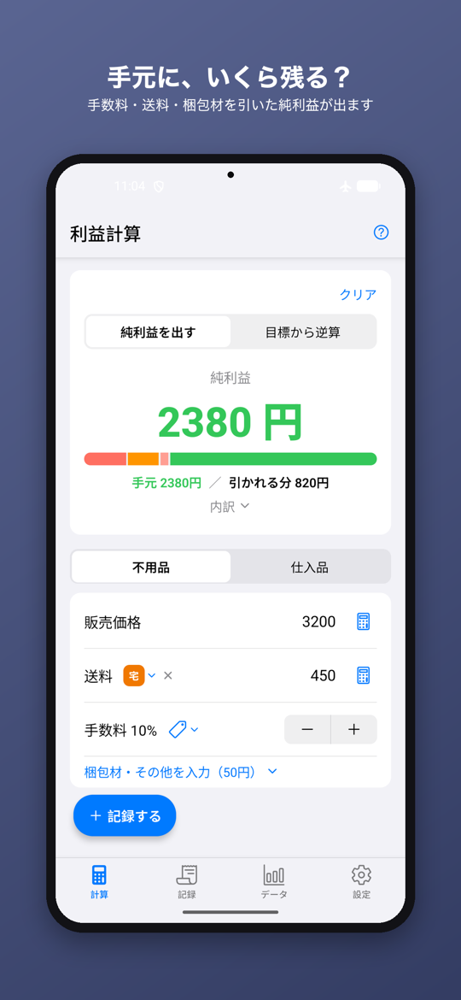
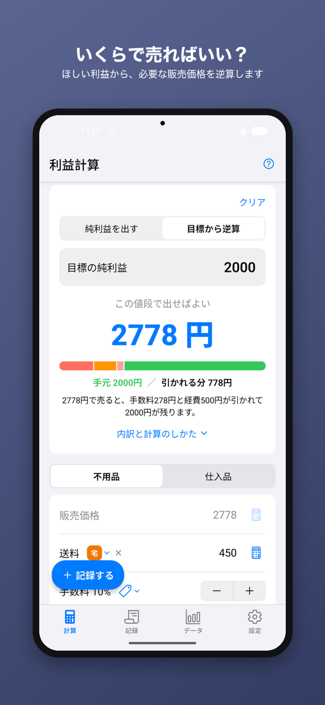
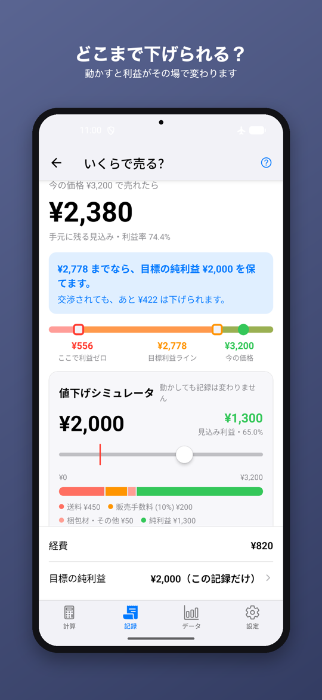
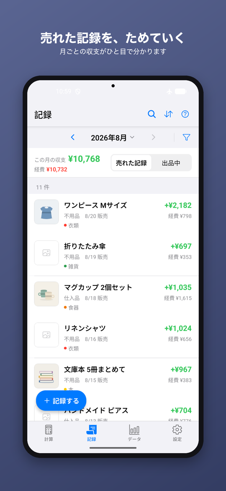
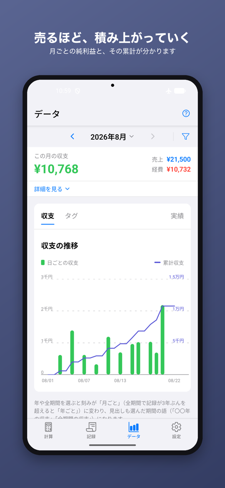
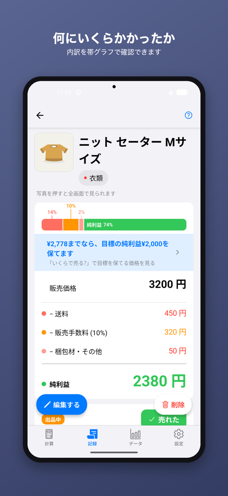

# うりつみ (Uritsumi)

フリマアプリの出品者向け、利益計算＆売上記録アプリ。
手数料・送料・梱包材を引いた**手元に残る金額**をその場で計算し、そのまま記録に残せます。

母が実際に使うために作ったアプリです。React Native (Expo) 製で、iOS / Android の両方で動きます。

## 主な機能

| | |
|---|---|
| **純利益の計算** | 販売価格・仕入値・送料・手数料・梱包材から手元に残る額を計算。内訳は帯グラフで確認できます |
| **目標から逆算** | ほしい利益を入れると、必要な販売価格を逆算します |
| **値下げシミュレーター** | 価格スライダーを動かすと利益がその場で変わり、どこまで下げられるかが分かります |
| **記録** | 不用品 / 仕入品の区別、写真・タグ・メモ付き。出品中と売却済みを月別に一覧 |
| **データ分析** | 月ごとの純利益と累計、期間比較、タグ別収支 |
| **バックアップ** | 写真を含めたデータの書き出し・復元 |

日本語 / 英語対応。ライト・ダークテーマ自動切り替え。

## スクリーンショット

<p>
  
  
  
</p>
<p>
  
  
  
</p>

## 技術スタック

- **Expo SDK 57** + React Native 0.86 + TypeScript
- **expo-router** — ファイルベースルーティング（計算 / 記録 / データ / 設定 の 4 タブ）
- **expo-sqlite + drizzle-orm** — 永続化（マイグレーション付き）
- **zustand** — 状態管理
- **react-native-gifted-charts** / **react-native-svg** — グラフ・図版
- **react-native-reanimated** — アニメーション
- **vitest** — 計算ロジックのテスト

## 開発

```bash
cd app-rn
npm install
npx expo start
```

ネイティブビルドは `npm run ios` / `npm run android`（`ios/` `android/` は prebuild 生成物のため git 管理外）。

その他のコマンド:

```bash
npm test              # vitest
npm run lint          # eslint
npm run db:generate   # drizzle マイグレーション生成
```

## リポジトリ構成

```
.
├── app-rn/    # アプリ本体（Expo プロジェクト）
├── docs/      # 仕様書（SPEC.md 〜 SPEC-V9.md）・UI 仕様・スクリーンショット
└── LICENSE
```

仕様の詳細は [docs/SPEC.md](docs/SPEC.md)、以降の改訂は `docs/SPEC-V2.md` 〜 `docs/SPEC-V9.md` にあります。

## 経緯

初版は SwiftUI + CoreData で書かれた iOS 専用アプリでした。Android にも届けるため React Native へ全面的に作り直しています。
旧 SwiftUI 版のソースは削除済みですが、その仕様は [docs/SPEC.md](docs/SPEC.md) に記録として残しており、コミット履歴からも参照できます。

## ライセンス

MIT — [LICENSE](LICENSE)
